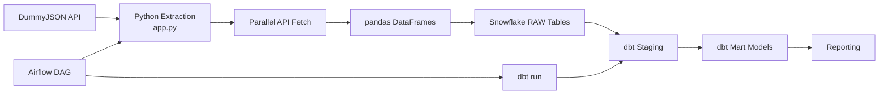

# E-Commerce Data to Snowflake Pipeline

This project builds an end-to-end data pipeline for an e-commerce dataset. It extracts data from the DummyJSON API, loads it into Snowflake, transforms it with dbt, and orchestrates the workflow with Apache Airflow.

The main goal is to demonstrate a realistic ELT pattern:

- Extract raw e-commerce data from an API
- Load raw tables into Snowflake
- Clean and model the data in dbt
- Deliver analytics-ready tables for reporting and dashboarding

---

## Project overview

The pipeline is built around a simple but practical architecture:

1. Python script extracts data from the DummyJSON API using parallel requests.
2. Data is flattened and converted into pandas DataFrames.
3. DataFrames are uploaded directly to Snowflake using the Snowflake pandas connector.
4. dbt models create staging and mart tables for reporting.
5. Apache Airflow schedules and runs the pipeline automatically.

---

## What is included

### 1. API extraction layer
The Python code in [app.py](app.py) connects to DummyJSON and extracts data from:

- products
- users
- carts
- cart items

It uses:

- ThreadPoolExecutor for parallel API pagination
- pandas for transformation and type handling
- python-dotenv to load environment variables
- Snowflake connector to upload data into raw tables

### 2. Snowflake raw storage
The pipeline creates and loads the following tables into the RAW schema:

- RAW_PRODUCTS
- RAW_USERS
- RAW_CARTS
- RAW_CART_ITEMS

The script also auto-creates schemas in Snowflake if they do not already exist.

### 3. dbt transformation layer
The project inside [ecommerce_dbt](ecommerce_dbt) builds a clean analytics layer.

Staging models:

- stg_products.sql
- stg_users.sql
- stg_carts.sql
- stg_cart_items.sql

Mart models:

- dim_products.sql
- dim_customers.sql
- fct_orders.sql

These models turn raw API data into a more usable reporting structure.

### 4. Airflow orchestration
The DAG in [dags/ecommerce_pipeline_dag.py](dags/ecommerce_pipeline_dag.py) runs the pipeline in the following order:

1. Extract + load raw data into Snowflake
2. Run dbt models
3. Execute dbt tests

This gives you a scheduled pipeline that can run daily at midnight.

---

## Tech stack

- Python
- pandas
- requests
- python-dotenv
- Snowflake
- dbt
- Apache Airflow

---

## Repository structure

```text
.
├── app.py                          # Main extraction and load workflow
├── requirements.txt               # Python dependencies
├── .env                           # Local environment secrets (not committed)
├── .gitignore                     # Git ignore rules
├── dags/
│   └── ecommerce_pipeline_dag.py  # Airflow orchestration DAG
├── ecommerce_dbt/
│   ├── dbt_project.yml
│   ├── profiles.yml
│   ├── models/
│   │   ├── marts/
│   │   └── staging/
│   ├── tests/
│   └── target/
├── airflow_steps.txt              # Airflow setup instructions
├── dbt_steps.txt                  # dbt setup instructions
├── logs/
├── data/
└── README.md
```

---

## How the pipeline works

### Extraction
The script calls the DummyJSON API and fetches product, user, and cart data. Pagination is handled in parallel to make extraction faster.

### Transformation
The raw JSON payload contains nested objects and arrays. The Python pipeline flattening logic converts this into tabular data with a stable schema.

Examples include:

- user address information extracted into city/country columns
- cart products exploded into item-level rows
- numeric fields converted to proper pandas data types before Snowflake upload

### Loading
Data is loaded into Snowflake using `write_pandas`, which creates tables automatically based on the DataFrame schema and overwrites them on each run.

### Modeling
dbt then creates a clean layer:

- staging models normalize and rename fields
- dim tables provide dimensions for products and customers
- fact table aggregates order data for analysis

---

## Architecture diagram



---

## Environment configuration

This project expects a `.env` file with Snowflake credentials, such as:

```bash
SNOWFLAKE_ACCOUNT=your_account
SNOWFLAKE_USER=your_user
SNOWFLAKE_PASSWORD=your_password
SNOWFLAKE_WAREHOUSE=COMPUTE_WH
SNOWFLAKE_DATABASE=ECOMMERCE_DB
SNOWFLAKE_ROLE=ACCOUNTADMIN
```

The dbt Snowflake profile is also configured in [ecommerce_dbt/profiles.yml](ecommerce_dbt/profiles.yml).

---

## Installation

Create a virtual environment and install the dependencies:

```bash
python -m venv env
source env/bin/activate   # Linux/macOS
# or .\env\Scripts\activate on Windows

pip install -r requirements.txt
```

---

## Run the pipeline manually

From the project root:

```bash
python app.py
```

This will:

- pull data from the API
- build Snowflake-ready DataFrames
- create schemas if missing
- upload raw tables to Snowflake

---

## Run dbt locally

```bash
cd ecommerce_dbt

dbt debug
dbt run
dbt test
```

---

## Run with Airflow

Start Airflow with:

```bash
export AIRFLOW_HOME=~/airflow
airflow db init
airflow users create --username admin --password admin --firstname Admin --lastname User --role Admin --email admin@example.com
airflow webserver --port 8080
```

In another terminal:

```bash
export AIRFLOW_HOME=~/airflow
airflow scheduler
```

The DAG is located in [dags/ecommerce_pipeline_dag.py](dags/ecommerce_pipeline_dag.py).

---

## Example analytics questions this project supports

- Which products have the highest sales volume?
- Which customers order most frequently?
- What is the average order value?
- Which categories generate the highest revenue?
- How much discount is being applied to products and carts?

---

## Notes about this project

This is a good example of a beginner-to-intermediate data engineering project because it combines:

- API ingestion
- data transformation
- warehouse loading
- dbt modeling
- orchestration
- cloud warehouse setup

It is especially useful as a learning project for understanding the full modern data stack flow from source system to analytics-ready warehouse tables.

---

## Potential improvements

Some next steps could include:

- add incremental loading instead of full overwrite
- add data quality checks beyond dbt tests
- store logs and metadata per pipeline run
- add CI/CD for dbt validation
- add orchestration for environment-specific deployment
- move secrets management to a secure system such as Vault or Snowflake key-pair auth

---

## Summary

This project demonstrates a complete e-commerce ELT workflow: fetch raw data, land it in Snowflake, transform it using dbt, and orchestrate it with Airflow. It is a practical example of how data pipelines are structured in a real warehouse-based analytics environment.
